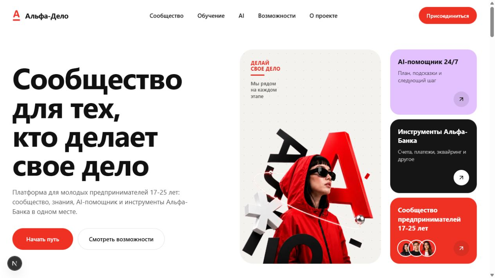
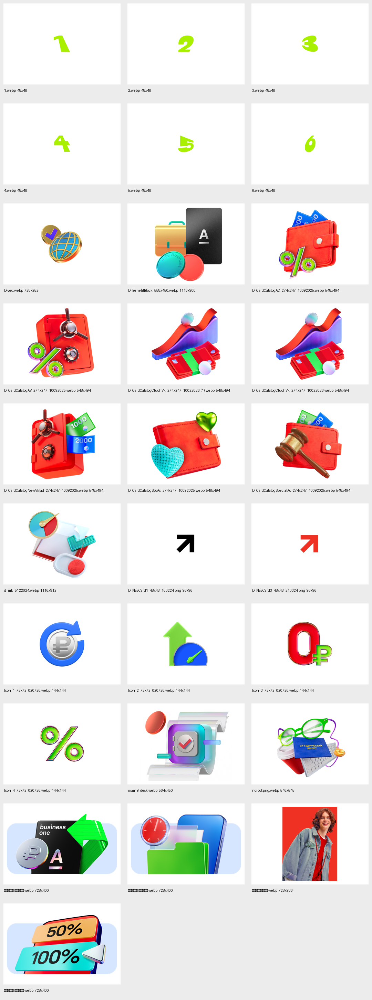

# Design Improvement: «Альфа-Дело»

## TL;DR

Сайт уже использует правильное системное семейство шрифтов Альфа-Банка, но визуально всё ещё отличается из-за завышенного масштаба, отрицательного трекинга и слишком жирных кнопок. Главная структурная проблема — страница много раз повторяет одни и те же возможности, но не показывает цельный путь пользователя от идеи до первой оплаты и роста.

Рекомендованное направление: официальный цифровой язык Альфы как база, продуктовая демонстрация вместо декоративных карточек и более формальный B2B-тон. Креативность оставить в одном сильном тезисе на секцию и в фирменных ассетах.

## Current State



Первый экран заметный и узнаваемый, но заголовок занимает непропорционально много пространства, а три дополнительные карточки конкурируют с главным сообщением. Ниже повторяются три близких слоя: «Что вы получите», «Что внутри платформы» и отдельные разделы AI/сообщества/банковских инструментов.

## Typography Audit

| Элемент | Текущий сайт | Официальная страница Альфы | Рекомендация |
|---|---:|---:|---:|
| H1 desktop | 76 px / 74 px, 700, tracking -1.9 px | 48 px / 52 px, 700, tracking normal | 48–56 px / 1.08, 700, tracking normal |
| H2 desktop | 52 px / 54 px, 700, tracking -1.3 px | 40 px / 48 px, 700 | 40 px / 48 px, 700 |
| H3 | 24–28 px, 700 | 22 px / 26 px, 700 | 22 px / 26 px, 700 |
| Основной текст | 17 px / 25 px | 16 px / 24 px; вторичный 14 px / 20 px | 16 px / 24 px |
| Кнопка | 15 px / 23 px, 600 | 14 px / 20 px, 500 | 14 px / 20 px, 500 |

Семейство сейчас настроено верно: `system-ui, -apple-system, Segoe UI, Roboto...`. Это подтверждено проверкой computed styles на официальной странице Business One: H1/H2/H3 используют `system-ui`, а `document.fonts` не показывает загруженных брендовых веб-шрифтов. В выданной папке ассетов файлов шрифтов также нет. Локальные файлы Styrene остаются в проекте, но не импортируются и не участвуют в рендеринге; синтетические начертания отключены.

## Improvement Ideas

### 1. Собрать первый экран вокруг одного B2B-обещания ⭐

Текущий заголовок «Сообщество для тех, кто делает свое дело» звучит широко и не объясняет роль Альфы. Он также разбит на четыре строки и занимает почти половину экрана. Нужен тезис, который связывает предпринимательский путь, AI и платежный бизнес.

Предлагаемый вариант:

> **От идеи до первой оплаты — с понятным планом и поддержкой Альфы**

Подзаголовок:

> Альфа-Дело помогает выбрать следующий шаг, проверить бизнес-гипотезу и подключить финансовые инструменты в момент, когда они действительно нужны.

CTA: **Составить план запуска**. Вторичный CTA: **Посмотреть возможности**.

Справа — одна крупная официальная композиция (`студентик.webp` или `D_BenefitBlock_558x450.webp`) и компактная демонстрация результата: «ваша стадия → следующий шаг → подходящий инструмент». Три отдельные промокарточки из hero убрать.

**Визуальный ориентир:** [Альфа-Банк Business One](https://alfabank.ru/sme/cards/businessonecard/). [Stripe Atlas](https://stripe.com/atlas/) используется только как функциональный пример демонстрации результата, не как источник стиля.

**Why this works:** Альфа строит hero вокруг одного продукта и одной кнопки, а Stripe показывает результат сервиса прямо в первом экране. Пользователь сразу понимает, что получит.

**Sketch:**

```text
+---------------------------------------------------------------+
| АЛЬФА-ДЕЛО                       Навигация          [Войти]    |
|                                                               |
| От идеи до первой оплаты     +-----------------------------+  |
| — с понятным планом          |  Ваша стадия: Есть идея     |  |
| и поддержкой Альфы           |  Следующий шаг: спрос       |  |
|                              |  Инструмент: AI-диагностика |  |
| Короткое формальное          |          [3D-ассет Альфы]   |  |
| объяснение продукта          +-----------------------------+  |
| [Составить план запуска] [Как это работает]                   |
+---------------------------------------------------------------+
```

**Конкретно:** уменьшить H1 до 52–56 px; убрать `HeroFeatureCards` из первого экрана; заменить общий текст конкретным обещанием; использовать выданный крупный ассет.

### 2. Перестроить страницу из каталога функций в путь предпринимателя ⭐

Документ описывает цельную логику: сообщество даёт опыт → контент объясняет действия → AI формирует персональный маршрут → Альфа помогает выполнить финансовый шаг. На сайте эта последовательность распалась на множество равнозначных секций.

Предлагаемая структура:

1. Hero с ценностным предложением.
2. Выбор стадии и направления.
3. Персональный маршрут из 3–4 шагов.
4. Демонстрация приложения и Founder Passport.
5. Финансовые инструменты в контексте задачи.
6. Сообщество и экспертная поддержка.
7. Измеримые цели пилота и CTA.

**Визуальный ориентир:** [Альфа-Банк — регистрация бизнеса](https://alfabank.ru/sme/start/). Brex и Ramp используются только как функциональные примеры сценарного рассказа и доказательности.

**Why this works:** пользователь читает страницу как сценарий, а не как каталог. Платежные продукты появляются в нужный момент и не выглядят навязанной рекламой.

**Sketch:**

```text
ИДЕЯ            ПРОВЕРКА          ЗАПУСК           РОСТ
  01  --------->  02  ---------->  03  ---------->  04
AI-диагностика   Проверка спроса   Первая оплата    Аналитика
Сообщество       Шаблон оффера     СБП / ссылка     Эквайринг
```

**Карта переноса контента:**

| Сейчас | После перестройки |
|---|---|
| Hero + `HeroFeatureCards` | Единый hero; тезисы карточек переходят в короткую строку возможностей |
| `ScenarioPicker` | Сохраняется как первый шаг персонального маршрута |
| `BenefitCards` + `PlatformFeatures` | Объединяются в «Что входит в Альфа-Дело» без повторов |
| `AiNavigatorSection` + блок прототипа | Объединяются в «Как работает Альфа-Дело» с Founder Passport |
| `FinancialToolsSection` | Сохраняется и связывается со стадиями маршрута |
| `CommunityPreviewSection` | Сохраняется как «Практика предпринимателей» |
| `ReviewsSection` | Заменяется подтверждёнными кейсами или сценариями использования |
| `TrustCards` | Превращаются в компактную строку доверия рядом с продуктами |
| `FinalCta` | Сохраняется с действием «Составить план запуска» |

**Конкретно:** сократить количество самостоятельных секций примерно с 11 до 7 без удаления сообщества, обучения или молодого характера продукта.

### 3. Перейти на официальный визуальный язык Альфы и использовать выданные ассеты по назначению ⭐



Сейчас на странице слишком много одновременно красных, лавандовых, зелёных и розовых карточек. Это создаёт молодёжный lifestyle-вайб, но ослабляет банковскую уверенность. У Альфы основа спокойнее: белый и светло-серый фон, чёрная типографика, красный CTA, а насыщенный цвет сосредоточен в предметной 3D-иллюстрации.

Приоритет использования ассетов:

- `студентик.webp` — hero или блок аудитории;
- `D_BenefitBlock_558x450.webp` — ценностное предложение / бизнес-карта;
- `mainB_desk.webp` — автоматизация и управление операциями;
- `первая штука.webp`, `вторая штука.webp`, `третья штука.webp` — крупные продуктовые главы;
- `D_CardCatalog*.webp` — только для конкретных банковских предложений;
- `D_NavCard*.png` — фирменные стрелки;
- `Logo_D_red.svg` и `Logo_D_white.svg` — вместо самодельной версии знака, если лицензия папки это допускает.

**Визуальный ориентир:** [Альфа-Банк Business One](https://alfabank.ru/sme/cards/businessonecard/). Wise используется только как функциональный пример полезного инструмента.

**Why this works:** фирменная графика становится доказательством связи с экосистемой банка. Каждый яркий объект отвечает за конкретный продуктовый смысл.

**Sketch:**

```text
+-------------------------+  +----------------------------------+
| ПЕРВАЯ ОПЛАТА           |  |                                  |
| СБП или платежная ссылка|  |       [официальный 3D-ассет]     |
| Подключение по готовности|  |                                  |
| бизнеса                 |  |                     [Подробнее →]|
+-------------------------+  +----------------------------------+
```

**Конкретно:** сократить пастельные фоны до 1–2 акцентных секций; заменить часть текущих иллюстраций ассетами из папки; оставить красный для CTA и ключевых состояний; увеличить долю белых поверхностей.

### 4. Сделать демонстрацию продукта центральной, а не декоративной

Блок прототипа должен отвечать не на вопрос «какие экраны существуют», а на вопрос «как продукт помогает принять решение». Один активный сценарий должен показывать входные данные, рекомендацию AI, следующий шаг и банковский инструмент. Founder Passport из документа — сильный объединяющий объект, которого сейчас почти не видно.

**Функциональные примеры:** Stripe Atlas и Mercury. Визуальные параметры блока должны оставаться в системе официальных страниц Альфы.

**Why this works:** в сильных B2B-сайтах интерфейс демонстрирует ценность продукта. Мокап перестаёт быть картинкой телефона и становится объяснением механики.

**Sketch:**

```text
+----------------------+  +------------------------------------+
| FOUNDER PASSPORT     |  | AI-РЕКОМЕНДАЦИЯ                    |
| Стадия: запуск       |  | 1. Проверить спрос                 |
| Прогресс: 62%        |  | 2. Подготовить оффер               |
| Цель: первая оплата  |  | 3. Создать платежную ссылку        |
|                      |  | [Перейти к шагу]                   |
+----------------------+  +------------------------------------+
```

**Конкретно:** переименовать раздел в «Как работает Альфа-Дело»; показать одну связную цепочку; добавить Founder Passport; убрать технические подписи вроде «Экран 1 из 5», если они не помогают пользователю.

### 5. Переписать тексты как B2B-продукт и убрать недоказанные заявления

Тон должен быть деловым, но не канцелярским. Креативный тезис допустим в H1, далее текст должен объяснять функцию, результат и ограничение. Слова «без воды», «за пару минут», «подскажет всё» и общие обещания стоит заменить конкретикой.

Примеры:

| Сейчас | Предлагается |
|---|---|
| «Подсказывает следующий шаг» | «Составляет план запуска по вашей стадии и цели» |
| «От идеи до роста — подскажем, что делать» | «AI учитывает стадию бизнеса и выполненные действия, чтобы предложить следующий практический шаг» |
| «Когда нужны инструменты Альфы» | «Финансовые инструменты на каждом этапе бизнеса» |
| «Подключайте нужное — за пару минут» | «Платформа рекомендует СБП, эквайринг, кассу или выплаты в момент возникновения задачи» |
| «Что вы получите» | «Единая среда для запуска и развития бизнеса» |
| «Что обсуждают» | «Практика предпринимателей» |

Текущие отзывы прямо помечены в коде как заглушки. Их нельзя показывать как реальные отзывы: для банка это репутационный риск. До появления подтверждённых историй заменить раздел на «Сценарии использования» или на прогнозные KPI пилота с явной маркировкой «цель пилота».

**Функциональные примеры:** Ramp и Brex. Формулировки и визуальная подача должны следовать официальному тону Альфы.

**Why this works:** формальный текст повышает доверие, а конкретные результаты помогают оценить продукт без завышенных обещаний.

**Sketch:**

```text
ЦЕЛИ ПИЛОТА
+----------------+ +----------------+ +----------------+
| Профили        | | Диагностика     | | Клиенты        |
| Founder Passport| | AI             | | платёжного     |
| цель пилота    | | цель пилота     | | бизнеса        |
+----------------+ +----------------+ +----------------+
* Числа публикуются только после согласования: в PDF есть конфликт между целями 30% и 70% прохождения AI-диагностики.
```

**Конкретно:** переписать заголовки и подзаголовки всех секций; удалить или переименовать `ReviewsSection`; добавить явные квалификаторы для прогнозных чисел; использовать букву «ё» и длинные тире последовательно.

## What's Working

- Системное семейство шрифтов уже совпадает с официальным сайтом Альфы.
- Сценарный выбор «направление × стадия» соответствует логике документа и его стоит сохранить.
- Финансовые инструменты связаны с реальными продуктами платежного бизнеса.
- Первый экран уже имеет узнаваемую красно-чёрную айдентику.
- Код использует адаптивную сетку, семантические секции и доступные элементы управления.

## Implementation Order

| # | Работа | Оценка | Импакт |
|---|---|---:|---:|
| 1 | Типографическая шкала и тексты hero | 1–2 ч | Очень высокий |
| 2 | Новая структура и удаление повторов | 6–10 ч | Очень высокий |
| 3 | Интеграция официальных ассетов | 2–4 ч | Высокий |
| 4 | Сценарная демонстрация продукта и Founder Passport | 8–14 ч | Высокий |
| 5 | Редактура текстов и замена фальшивых отзывов | 2–4 ч | Высокий |

## All References

| Источник | Что взяли |
|---|---|
| [Альфа-Банк — Business One](https://alfabank.ru/sme/cards/businessonecard/) | Типографика, белая основа, карточки возможностей, красные CTA |
| [Альфа-Банк — регистрация бизнеса](https://alfabank.ru/sme/start/) | Структура пути начинающего предпринимателя |
| [Stripe Atlas](https://stripe.com/atlas/) | Только функциональный паттерн продуктовой демонстрации |
| [Mercury](https://mercury.com/) | Только функциональный паттерн продуктовых модулей |
| [Ramp for Startups](https://ramp.com/startups) | Только функциональный паттерн доказательности |
| [Wise Business](https://wise.com/us/business/) | Только функциональный паттерн полезного инструмента |
| [Brex Business Account](https://www.brex.com/product/business-account/) | Только функциональный паттерн сценарного описания |
| «Альфа кейс.pdf» | Концепция, аудитория, Founder Passport, AI-маршрут и KPI пилота |
